# Night Display v0.1.2 — AUTHOR screen evidence (24 original PNG captures)

**Source of truth for game:** [`f622320296a6484b8c68a6fb05d38ff3ebee4171`](https://github.com/Queenrain9/Danteam/commit/f622320296a6484b8c68a6fb05d38ff3ebee4171) / `night-display/play.html` Git blob `4f33168575e0adedf8b34ee3a7ed65fe31595fb2`.

**Evidence scope:** 24 untouched full-screen PNGs from author-controlled **Chromium / Playwright mobile touch viewport emulation**, 320×640 and 360×800. The exact inline game source is used; this is **not** a live hosted game, independent QA, real phone, real human observation, or proof of silent-story comprehension. No images were drawn/generated as substitute for browser screenshots.

Each filename has its source placement and requested phase-relative target time. The observed phase, capture-start elapsed time (not a video frame timestamp), SHA-256 and Git blob SHA-1 are recorded in [`public-frame-manifest.json`](public-frame-manifest.json). A screenshot can be inspected as a pixel frame; it **cannot prove perception/duration** by itself. Waited offsets are approximate (see actualOffsetMs), especially +500 ms in a 575-ms beat.

## Requested inspection order

- **H:** Compare `MCB-cue-200ms.png` vs `MCB-gaze-230ms.png`; inspect eyes/head/back-wall direction without highlighting M/B.
- **R0:** Compare `MKC-gaze-080ms.png`, `280ms`, `480ms` to distinguish genuine equal 3-slot scan from body/viewport translation; no clue slot should flash.
- **R1:** Compare `MCK-action-180ms.png` vs `440ms.png` for hand position relative to **current M slot**, not only text.
- **R2:** Compare `CBK-action-180ms.png`, `400ms.png`, `500ms.png` for hand-to-B and ripple timing; use manifest `rippleActive` with caution because CSS can show transient visual animation independently of RESULT residue.
- **R3:** Compare `MBK-action-440ms.png` vs `MBK-result-100ms.png` for finger-to-existing-doorplate → same keyhole mark; shelf items retain places.

## Original image files — 320×640

### MCB — H / 가운데 C → 뒷벽

**CUE · target +200 ms / actual +206 ms** · [full PNG](frames/320x640/MCB-cue-200ms.png)

**GAZE · target +230 ms / actual +236 ms** · [full PNG](frames/320x640/MCB-gaze-230ms.png)

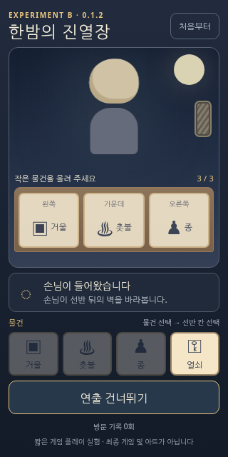

### MKC — R0 / 비강조 선반 스캔

**GAZE · target +80 ms / actual +90 ms** · [full PNG](frames/320x640/MKC-gaze-080ms.png)

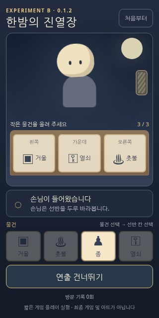

**GAZE · target +280 ms / actual +287 ms** · [full PNG](frames/320x640/MKC-gaze-280ms.png)

**GAZE · target +480 ms / actual +487 ms** · [full PNG](frames/320x640/MKC-gaze-480ms.png)

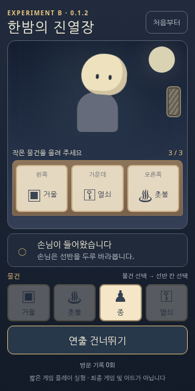

### MCK — R1 / 손→거울

**ACTION · target +180 ms / actual +189 ms** · [full PNG](frames/320x640/MCK-action-180ms.png)

**ACTION · target +440 ms / actual +449 ms** · [full PNG](frames/320x640/MCK-action-440ms.png)

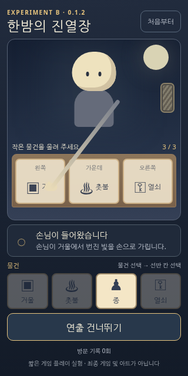

### CBK — R2 / 손→종·파문

**ACTION · target +180 ms / actual +188 ms** · [full PNG](frames/320x640/CBK-action-180ms.png)

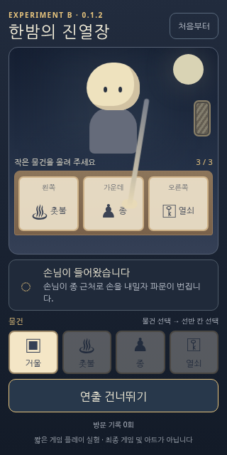

**ACTION · target +400 ms / actual +406 ms** · [full PNG](frames/320x640/CBK-action-400ms.png)

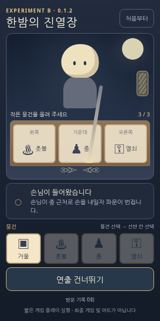

**ACTION · target +500 ms / actual +504 ms** · [full PNG](frames/320x640/CBK-action-500ms.png)

### MBK — R3 / 문 잠금판 접촉·잔여

**ACTION · target +440 ms / actual +444 ms** · [full PNG](frames/320x640/MBK-action-440ms.png)

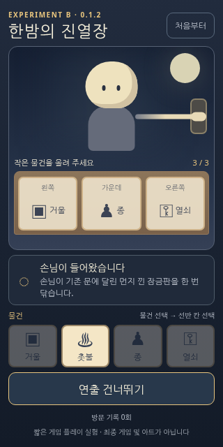

**RESULT · target +100 ms / actual +108 ms** · [full PNG](frames/320x640/MBK-result-100ms.png)

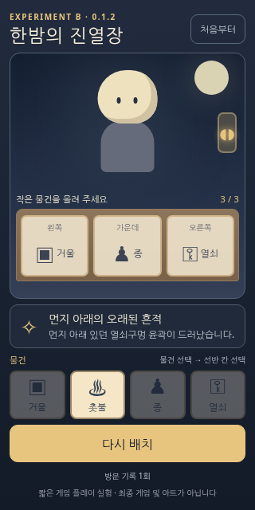

## Original image files — 360×800

### MCB — H / 가운데 C → 뒷벽

**CUE · target +200 ms / actual +205 ms** · [full PNG](frames/360x800/MCB-cue-200ms.png)

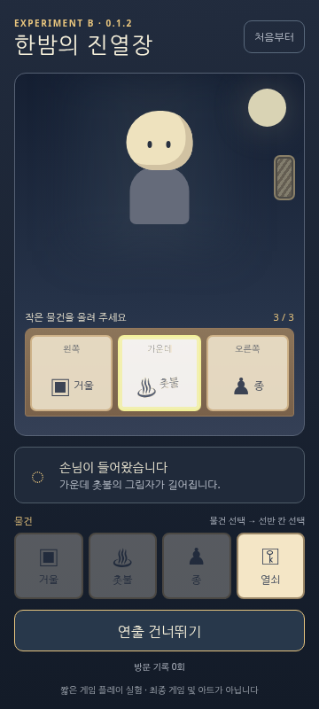

**GAZE · target +230 ms / actual +237 ms** · [full PNG](frames/360x800/MCB-gaze-230ms.png)

### MKC — R0 / 비강조 선반 스캔

**GAZE · target +80 ms / actual +91 ms** · [full PNG](frames/360x800/MKC-gaze-080ms.png)

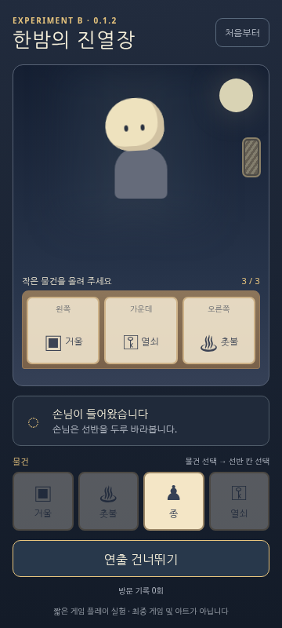

**GAZE · target +280 ms / actual +287 ms** · [full PNG](frames/360x800/MKC-gaze-280ms.png)

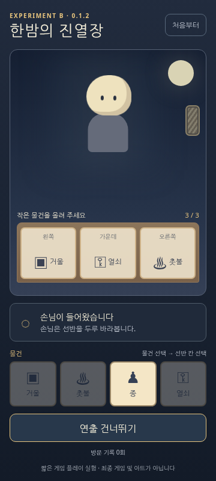

**GAZE · target +480 ms / actual +484 ms** · [full PNG](frames/360x800/MKC-gaze-480ms.png)

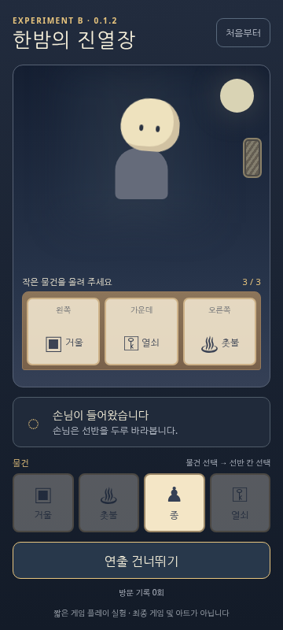

### MCK — R1 / 손→거울

**ACTION · target +180 ms / actual +186 ms** · [full PNG](frames/360x800/MCK-action-180ms.png)

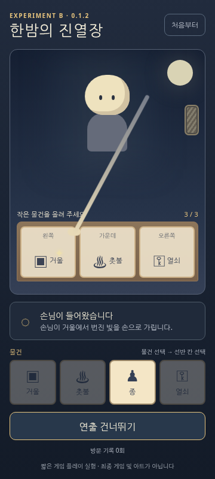

**ACTION · target +440 ms / actual +447 ms** · [full PNG](frames/360x800/MCK-action-440ms.png)

### CBK — R2 / 손→종·파문

**ACTION · target +180 ms / actual +188 ms** · [full PNG](frames/360x800/CBK-action-180ms.png)

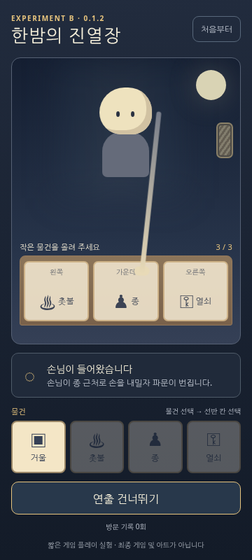

**ACTION · target +400 ms / actual +403 ms** · [full PNG](frames/360x800/CBK-action-400ms.png)

**ACTION · target +500 ms / actual +510 ms** · [full PNG](frames/360x800/CBK-action-500ms.png)

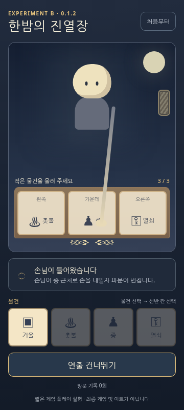

### MBK — R3 / 문 잠금판 접촉·잔여

**ACTION · target +440 ms / actual +450 ms** · [full PNG](frames/360x800/MBK-action-440ms.png)

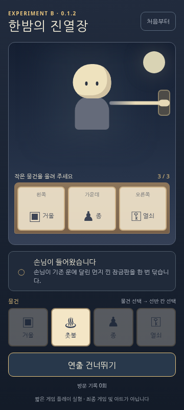

**RESULT · target +100 ms / actual +105 ms** · [full PNG](frames/360x800/MBK-result-100ms.png)

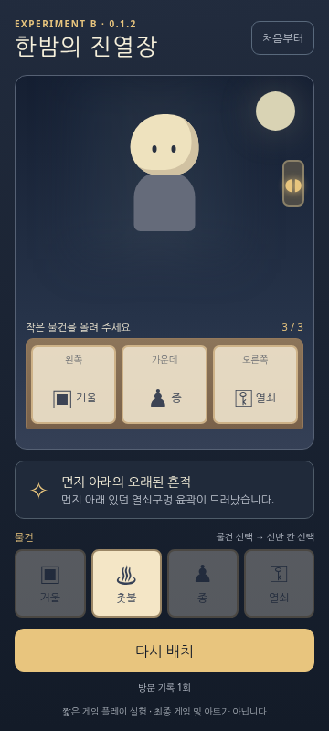

**Next:** LUX → SUN → ECHO each directly fetch/open these PNGs and record their own *frame analysis* separately from any independently executed browser/real-device/human QA. No new game patch is implied by publishing evidence.